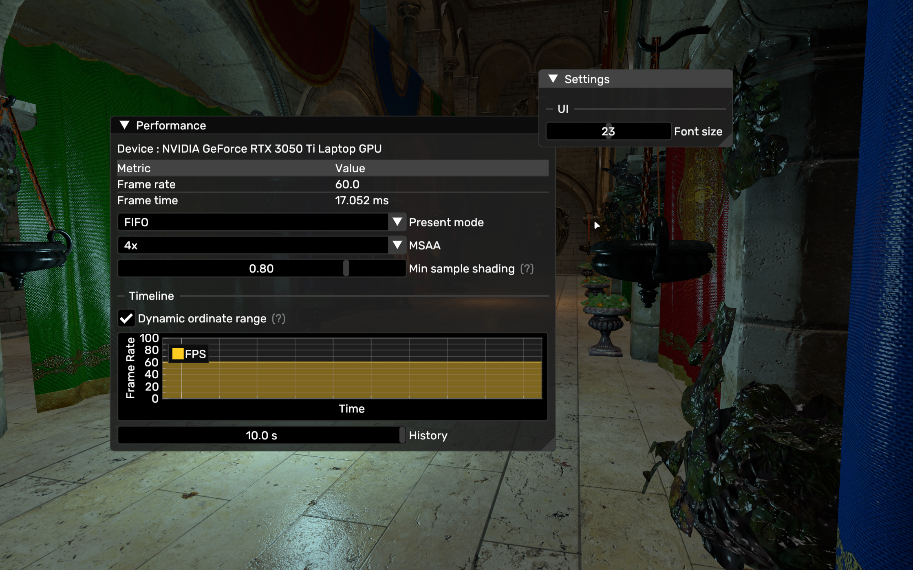

# Vulkan Renderer

A real‑time rasterization renderer written from scratch in C++17 with [Vulkan](https://www.vulkan.org/) providing a clean foundation for experimenting with advanced rendering techniques offering high performance, low-level control, and seamless portability across Linux and Windows.
<br/><br/>

## Table of Contents
> Latest first
+ [Features](#features)
    + [GUI](#gui)
    + [Normal Mapping](#normal-mapping)
    + [Blinn-Phong Lighting](#blinn-phong-lighting)
    + [Asset Loading](#asset-loading)
        + [3D Models](#3d-models)
        + [Textures](#textures)
    + [Anti-aliasing](#anti-aliasing)
        + [MSAA](#msaa)
        + [Mipmapping](#mipmapping)
+ [Cloning](#cloning)
+ [Building](#building)
    + [Linux](#linux)
    + [Windows](#windows)
+ [Resources](#resources)
+ [Contact](#contact)
<br/><br/>

## Features
<br/><br/>

## GUI
This project makes use of the docking branch of [ImGui](https://github.com/ocornut/imgui) to render a few useful UI elements. Will probably be expanded later with plans to add interactive gizmo. Plots are created using [ImPlot](https://github.com/epezent/implot).<br/> 
*For now, the Escape key switches between controlling the UI and the camera.*
<div align="center">
    <table>
        <tr>
            <td></td>
        </tr>
        <tr>
            <td>UI Showcase</td>
        </tr>
    </table>
</div>
<br/><br/>

## Normal Mapping
Normal mapping is handled using tangent-space normal maps. The TBN matrix is built in the vertex shader and passed to the fragment shader for lighting calculations.
<div align="center">
    <table>
        <tr>
            <td></td>
            <td></td>
        </tr>
        <tr>
            <td>No normal mapping</td>
            <td>Normal mapped</td>
        </tr>
    </table>
</div>
<br/><br/>

## Blinn-Phong Lighting
The renderer implements the Blinn-Phong reflection model supporting multiple point and directional lights, allowing dynamic illumination in the scene. Lighting calculations include ambient, diffuse, and specular components.
<div align="center">
    <table>
        <tr>
            <td></td>
            <td></td>
        </tr>
        <tr>
            <td>Ambient</td>
            <td>Diffuse</td>
        </tr>
        <tr>
            <td></td>
            <td></td>
        </tr>
        <tr>
            <td>Specular</td>
            <td>Normals</td>
        </tr>
    </table>
</div>
<br/><br/>

## Asset Loading
### 3D Models
This project uses the [Assimp](https://github.com/assimp/assimp) library to load 40+ 3D-file-formats. Once loaded, the models are smoothly integrated into the scene hierarchy.
<div align="center">
    <table>
        <tr>
            <td></td>
            <td></td>
        </tr>
        <tr>
            <td>obj model - 450k triangles</td>
            <td>fbx model - 500k triangles</td>
        </tr>
    </table>
</div>

### Textures
Textures are loaded using [stb_image](https://github.com/nothings/stb/blob/master/stb_image.h). The renderer applies anisotropic filtering, and mipmaps are generated during upload. 
<br/><br/><br/>

## Anti Aliasing
### MSAA
The renderer includes built-in support for MSAA to improve image quality and reduce aliasing artifacts.
<div align="center">
    <table>
        <tr>
            <td></td>
            <td></td>
        </tr>
        <tr>
            <td>No anti aliasing</td>
            <td>16x MSAA</td>
        </tr>
    </table>
</div>

### Mipmapping
Mipmaps are procedurally generated for each texture improving performance and reducing aliasing during minification. Mipmap levels are selected dynamically based on texture resolution.
<div align="center">
    <table>
        <tr>
            <td></td>
            <td></td>
        </tr>
        <tr>
            <td>No mipmapping (Moiré patterns)</td>
            <td>Using mipmaps</td>
        </tr>
    </table>
</div>
<br/><br/>

## Cloning
> [!IMPORTANT]
> This repository contains submodules for external dependencies. Clone recursively to ensure everything is fetched properly.
```
git clone --recurse-submodules --shallow-submodules https://github.com/MouadHaikal/Vulkan-Renderer
```
## Building
## Linux
### Dependencies
- CMake 3.20 or higher
- C++17 compatible compiler
- Vulkan SDK
- GLFW dependencies for Wayland and X11

> The following commands will install all the dependencies listed above:
#### Debian/Ubuntu
```
sudo apt install cmake build-essential vulkan-tools libvulkan-dev vulkan-validationlayers-dev spirv-tools libwayland-dev libxkbcommon-dev xorg-dev
```
#### Arch Linux
```
sudo pacman -S cmake base-devel vulkan-devel wayland libxkbcommon libxcursor libxi libxinerama libxrandr
```
> [!TIP]
> Run **vkcube** to make sure Vulkan is installed correctly. You should see a spinning cube with the LunarG logo on its faces.

A build script is available for convenience: [buildAndRun.sh](buildAndRun.sh)<br/>
The executable will be built to *{project_root}/bin/VulkanRenderer*<br/>

## Windows
### Dependencies
- CMake 3.20 or higher
- C++17 compatible compiler
- [Vulkan SDK](https://vulkan.lunarg.com/sdk/home#windows)

Use cmake to generate project files for your preferred build system then build the project as usual<br/>
<br/><br/>

## Resources
- [Official Vulkan Documentation](https://docs.vulkan.org/spec/latest/chapters/introduction.html) (Documentation)
- [Fundamentals of Computer Graphics](https://www.amazon.com/Fundamentals-Computer-Graphics-Steve-Marschner/dp/0367505037) (Book)
- [Vulkan Tutorial](https://vulkan-tutorial.com/) (Tutorial)
- [Official glTF Sample Assets](https://github.com/KhronosGroup/glTF-Sample-Assets/) (Assets)
<br/><br/>

## Contact
If you have any remarks, questions, or contributions regarding this project, feel free to reach out to me at mouad.haikal@um6p.ma
