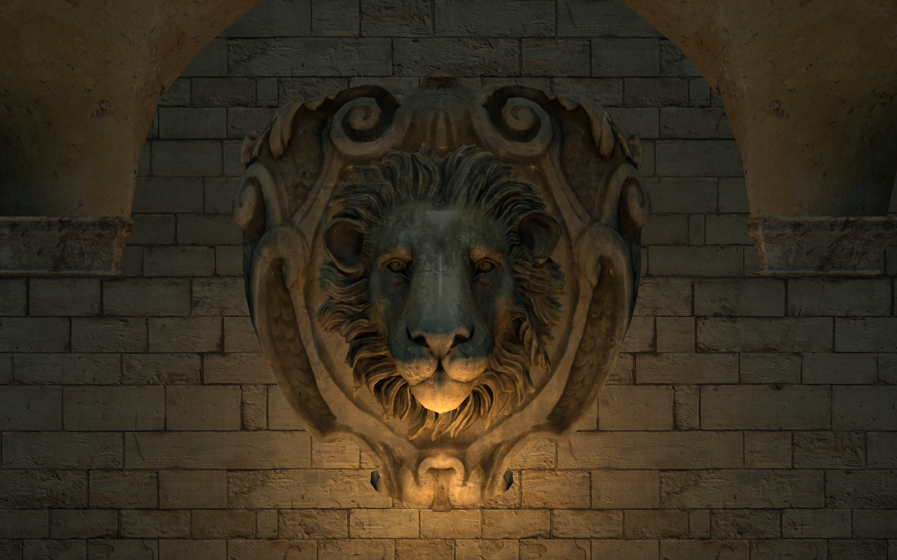
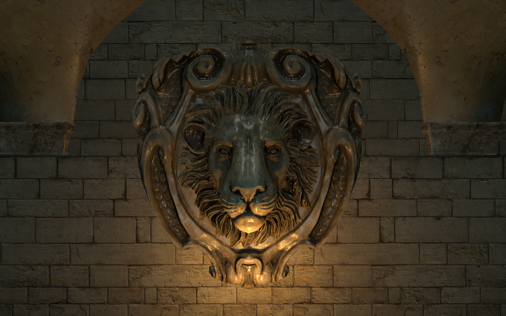
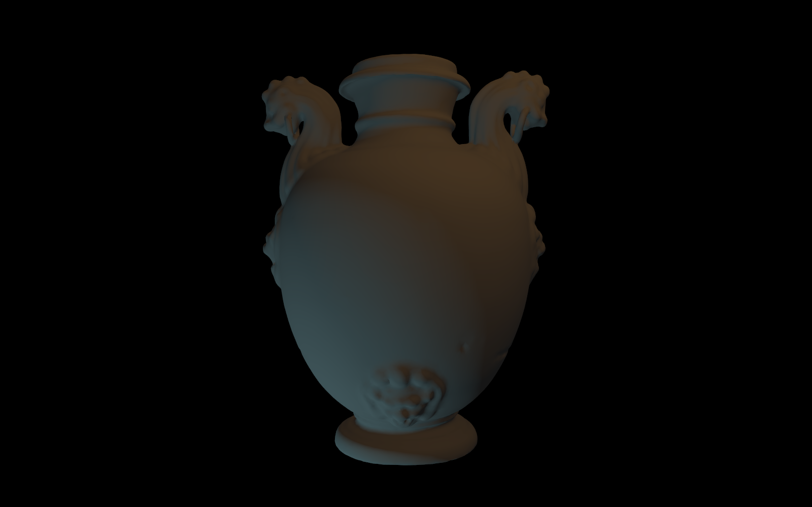
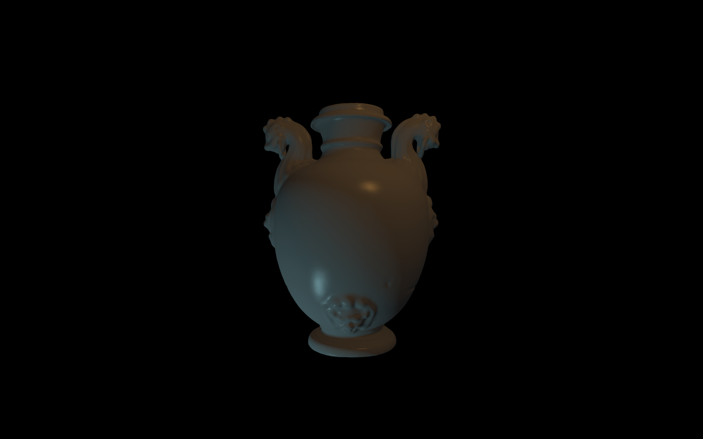
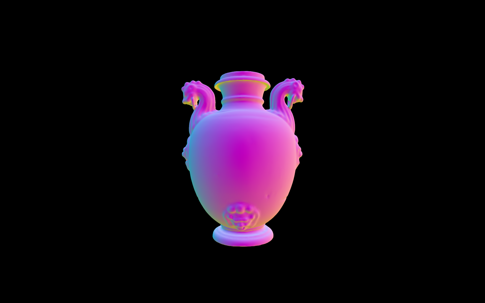

# Vulkan Renderer

A GPU-accelerated real‑time rasterization renderer written from scratch in modern C++ with [Vulkan](https://www.vulkan.org/) providing a clean foundation for experimenting with advanced rendering techniques offering high performance, low-level control, and seamless portability across Linux and Windows.
<br/><br/>

## Table of Contents
> Latest to oldest
+ [Features](#features)
    + [Normal Mapping](#normal-mapping)
    + [Blinn-Phong Lighting](#blinn-phong-lighting)
    + [Asset Loading](#asset-loading)
        + [3D Models](#3d-models)
        + [Textures](#textures)
    + [Anti-aliasing](#anti-aliasing)
        + [MSAA](#msaa)
        + [Mipmapping](#mipmapping)
    + [Camera Controls](#camera-controls)
+ [Cloning](#cloning)
    + [Building](#building)
+ [Resources](#resources)
+ [Contact](#contact)
<br/><br/>

## Features
> [!NOTE]
> This is an active project with features continuously being added and refined.
<br/><br/>

## Normal Mapping
Normal mapping is implemented using tangent-space normal maps to simulate high-frequency surface detail without increasing mesh complexity. The TBN matrix (tangent, bitangent, normal) is constructed in the vertex shader and passed to the fragment shader.
<div align="center">
    <table>
        <tr>
            <td></td>
            <td></td>
        </tr>
        <tr>
            <td>No normal mapping</td>
            <td>Normal mapped</td>
        </tr>
    </table>
</div>
<br/><br/>

## Blinn-Phong Lighting
The renderer implements the Blinn-Phong reflection model supporting multiple point lights and directional lights, allowing dynamic illumination in the scene. The lighting calculations include ambient, diffuse, and specular components.


<div align="center">
    <table>
        <tr>
            <td></td>
            <td></td>
        </tr>
        <tr>
            <td>Ambient</td>
            <td>Diffuse</td>
        </tr>
        <tr>
            <td></td>
            <td></td>
        </tr>
        <tr>
            <td>Specular</td>
            <td>Normals</td>
        </tr>
    </table>
</div>
<br/><br/>

## Asset Loading
### 3D Models
The renderer uses the [Assimp](https://github.com/assimp/assimp) library to load 40+ 3D-file-formats. Once loaded, vertex and index data are extracted and used to create GPU buffers. These models are then smoothly integrated into the scene hierarchy, allowing complex models with multiple meshes and materials to be handled seamlessly.


<div align="center">
    <table>
        <tr>
            <td></td>
            <td></td>
        </tr>
        <tr>
            <td>obj model - 450k triangles</td>
            <td>fbx model - 500k triangles</td>
        </tr>
    </table>
</div>

### Textures
Textures are loaded using [stb_image](https://github.com/nothings/stb/blob/master/stb_image.h). The renderer applies anisotropic filtering for higher-quality texture sampling at glancing angles and mipmaps are generated during upload to prevent aliasing and optimize performance. 
<br/><br/><br/>

## Anti Aliasing
### MSAA
Multi-Sample Anti-Aliasing is implemented to smooth jagged edges by sampling each pixel multiple times and averaging the results. This technique significantly improves visual quality with minimal performance impact, and is integrated directly into the render pass and framebuffer pipeline.

<div align="center">
    <table>
        <tr>
            <td></td>
            <td></td>
        </tr>
        <tr>
            <td>No anti aliasing</td>
            <td>16x MSAA</td>
        </tr>
    </table>
</div>

### Mipmapping
Mipmaps are procedurally generated for each texture improving performance and reducing aliasing during minification. Mipmap levels are selected dynamically based on texture resolution.

<div align="center">
    <table>
        <tr>
            <td></td>
            <td></td>
        </tr>
        <tr>
            <td>No mipmapping (Moiré patterns)</td>
            <td>Using mipmaps</td>
        </tr>
    </table>
</div>
<br/><br/>

## Camera Controls
The renderer implements real-time user-controlled camera movement using [GLFW](https://github.com/glfw/glfw) for input handling. The camera supports first-person navigation (WASD) and free-look via mouse movement. Input events are processed each frame and translated into position/orientation updates, enabling intuitive scene exploration.

<div align="center">
    <table>
        <tr>
            <td></td>
        </tr>
        <tr>
            <td>Camera Controls Demo</td>
        </tr>
    </table>
</div>
<br/><br/>

## Cloning
> [!IMPORTANT]
> This repository contains submodules for external dependencies. Clone recursively to ensure everything is fetched properly.
```
git clone --recurse-submodules --shallow-submodules https://github.com/MouadHaikal/Vulkan-Renderer
```
### Building
  *Work In Progress...*

<br/><br/>

## Resources
- [Official Vulkan Documentation](https://docs.vulkan.org/spec/latest/chapters/introduction.html) (Documentation)
- [Fundamentals of Computer Graphics](https://www.amazon.com/Fundamentals-Computer-Graphics-Steve-Marschner/dp/0367505037) (Book)
- [Vulkan Tutorial](https://vulkan-tutorial.com/) (Book)
- [Official glTF Sample Assets](https://github.com/KhronosGroup/glTF-Sample-Assets/) (Assets)
<br/><br/>

## Contact
If you have any remarks, questions, or contributions regarding this project, feel free to reach out to me at mouad.haikal@um6p.ma
